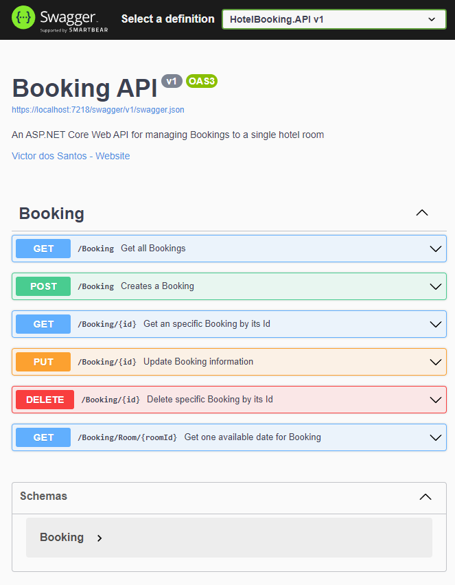

<div align="center">
  
  <h1>Hotel Booking :memo:</h1>
  
  <p>
    A .NET Core API to manage booking for a hotel!
  </p>
  
  
<!-- Badges -->
<p>
  <a href="https://github.com/m1thr4nd1r/HotelBooking/graphs/contributors">
    
  </a>
  <a href="">
    
  </a>
  <a href="https://github.com/m1thr4nd1r/HotelBooking/network/members">
    
  </a>
  <a href="https://github.com/m1thr4nd1r/HotelBooking/stargazers">
    
  </a>
  <a href="https://github.com/m1thr4nd1r/HotelBooking/issues/">
    
  </a>
  <a href="https://github.com/m1thr4nd1r/HotelBooking/blob/master/COPYING">
    
  </a>
</p>
   
<h4>
    <a href="https://github.com/m1thr4nd1r/HotelBooking">Documentation</a>
  <span> · </span>
    <a href="https://github.com/m1thr4nd1r/HotelBooking/issues/">Report Bug</a>
  <span> · </span>
    <a href="https://github.com/m1thr4nd1r/HotelBooking/issues/">Request Feature</a>
  </h4>
</div>

<br />

<!-- Table of Contents -->
# :notebook_with_decorative_cover: Table of Contents

- [About the Project](#star2-about-the-project)
  * [Tech Stack](#space_invader-tech-stack)
  * [Features](#dart-features)
- [Getting Started](#toolbox-getting-started)
  * [Prerequisites](#bangbang-prerequisites)
  * [Running Tests](#test_tube-running-tests)
  * [Run Locally](#running-run-locally)
  * [Deployment](#triangular_flag_on_post-deployment)
- [Usage](#eyes-usage)
- [Roadmap](#compass-roadmap)
- [Contributing](#wave-contributing)
  [License](#warning-license)
- [Contact](#handshake-contact)
- [Acknowledgements](#gem-acknowledgements)

  

<!-- About the Project -->
## :star2: About the Project

<!-- TechStack -->
### :space_invader: Tech Stack

<details>
  <summary>Server</summary>
  <ul>
    <li><a href="https://docs.microsoft.com/en-us/dotnet/core/">.Net Core</a></li>
    <li><a href="https://go.microsoft.com/fwlink/?LinkId=518016">ASP.Net Core 6.0</a></li>
    <li><a href="https://swagger.io/">Swagger</a></li>
    <li><a href="https://fluentassertions.com/">Fluent Assertions</a></li>
    <li><a href="https://fluentvalidation.net/">Fluent Validation</a></li>
    <li><a href="https://github.com/moq/moq4">Moq</a></li>
    <li><a href="https://xunit.net/">xUnit</a></li>    
  </ul>
</details>

<details>
<summary>Database</summary>
  <ul>
    <li><a href="https://www.nuget.org/packages/Microsoft.EntityFrameworkCore.InMemory/">EFCore InMemory Database</a></li>
  </ul>
</details>

<!-- Features -->
### :dart: Features

- Check all bookings;
- Check a specific reservation;
- Place a booking;
- Modify a reservation;
- Cancel/Delete a booking;
- Check for a room's next availability.

<!-- Getting Started -->
## 	:toolbox: Getting Started

<!-- Prerequisites -->
### :bangbang: Prerequisites

This project uses NuGet as the package manager

```bash
 nuget restore
```
   
<!-- Running Tests -->
### :test_tube: Running Tests

To run tests, run the following command

```bash
  dotnet test
```

<!-- Run Locally -->
### :running: Run Locally

Clone the project

```bash
  git clone https://github.com/m1thr4nd1r/HotelBooking.git
```

Go to the project directory

```bash
  cd HotelBooking
```

Install dependencies and build the project

```bash
  dotnet build
```

Start the server

```bash
  dotnet run --project HotelBooking.API
```

<!-- Usage -->
## :eyes: Usage

Upon locally running the project, the entry url (https://localhost:7218) will automatically redirect to the Swagger documentation index.

<div align="center"> 
  
</div>

<!-- Roadmap -->
## :compass: Roadmap

* [ ] Allow multi-client use with the same database.
* [ ] Allow primite types as parameters for Post and Put routes.


<!-- Contributing -->
## :wave: Contributing

<a href="https://github.com/m1thr4nd1r/HotelBooking/graphs/contributors">
  
</a>


Contributions are always welcome!

<!-- License -->
## :warning: License

Distributed under the GNU General Public License v3.0 or later. 
See [COPYING](https://github.com/m1thr4nd1r/HotelBooking/blob/main/COPYING) for more information.


<!-- Contact -->
## :handshake: Contact

Victor dos Santos - [@Mithr4nd1r](https://twitter.com/Mithr4nd1r) - vitocr_santos@hotmail.com

Project Link: [https://github.com/m1thr4nd1r/HotelBooking](https://github.com/m1thr4nd1r/HotelBooking)


<!-- Acknowledgments -->
## :gem: Acknowledgements

Use this section to mention useful resources and libraries that you have used in your projects.

 - [Awesome README Template](https://github.com/Louis3797/awesome-readme-template)
 - [Shields.io](https://shields.io/)
 - [Emoji Cheat Sheet](https://github.com/ikatyang/emoji-cheat-sheet/blob/master/README.md#travel--places)
